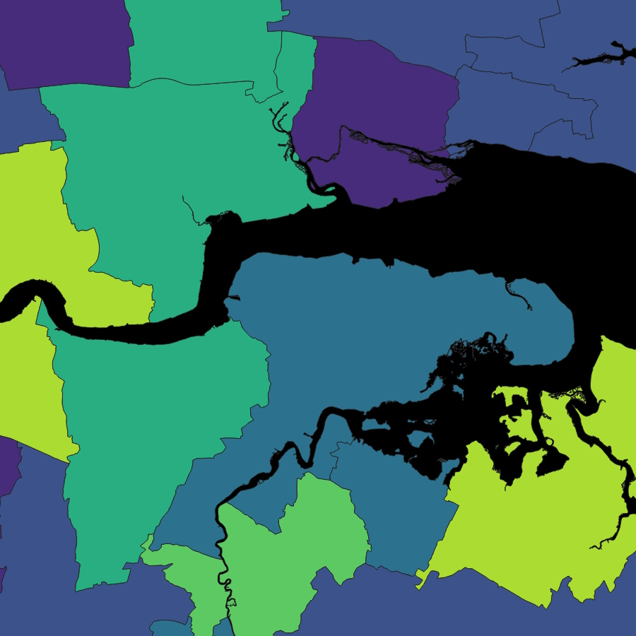
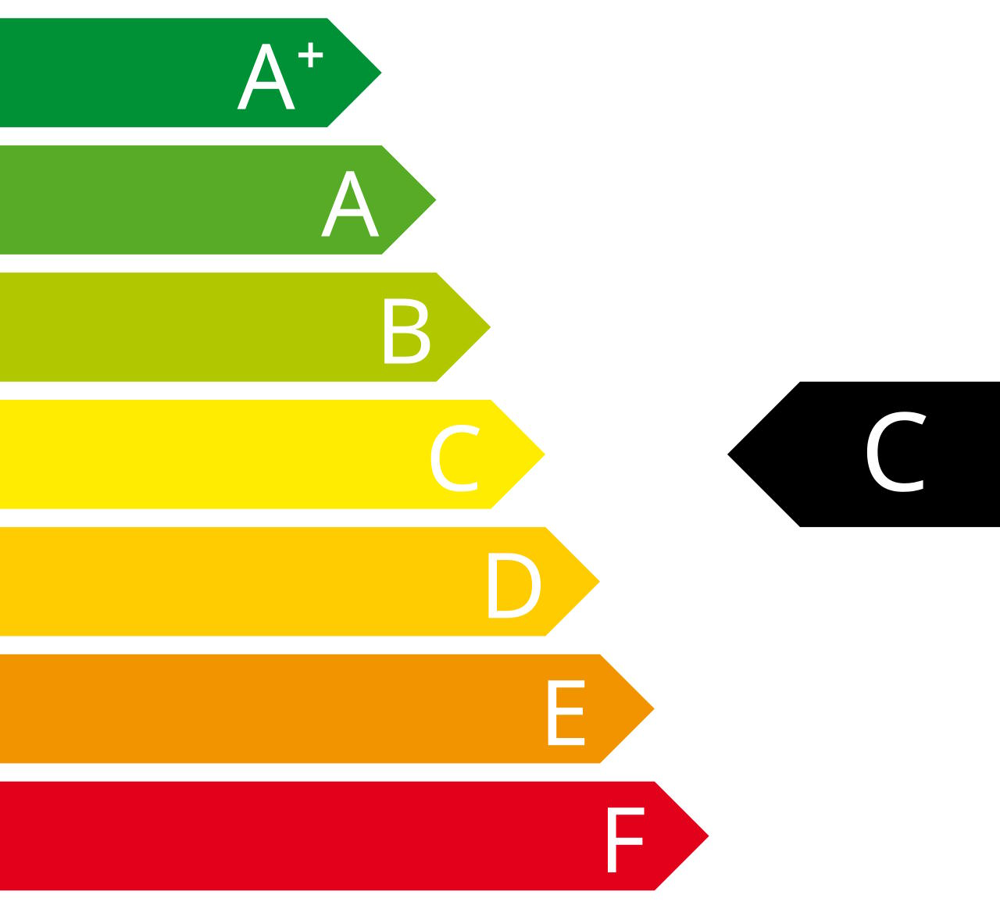
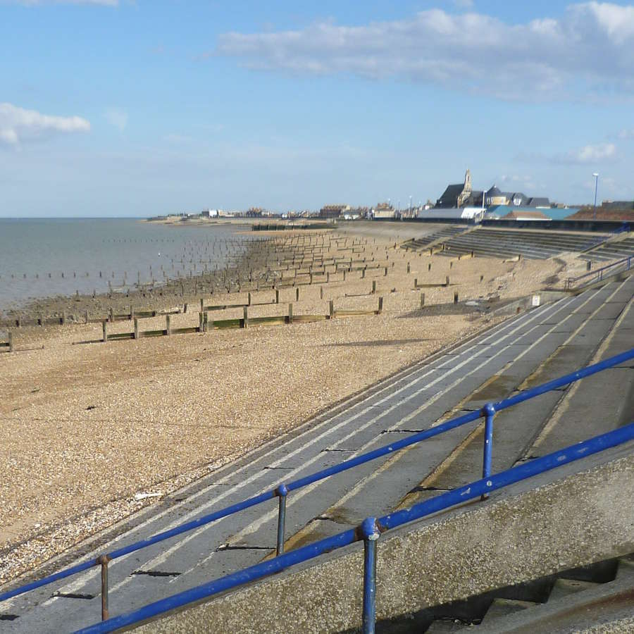
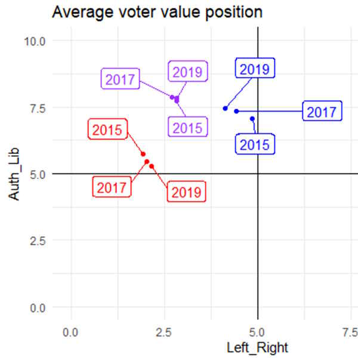
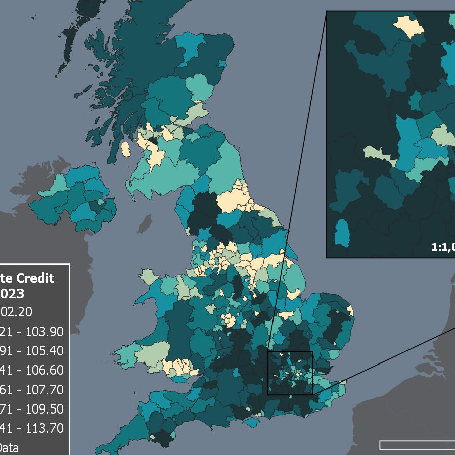
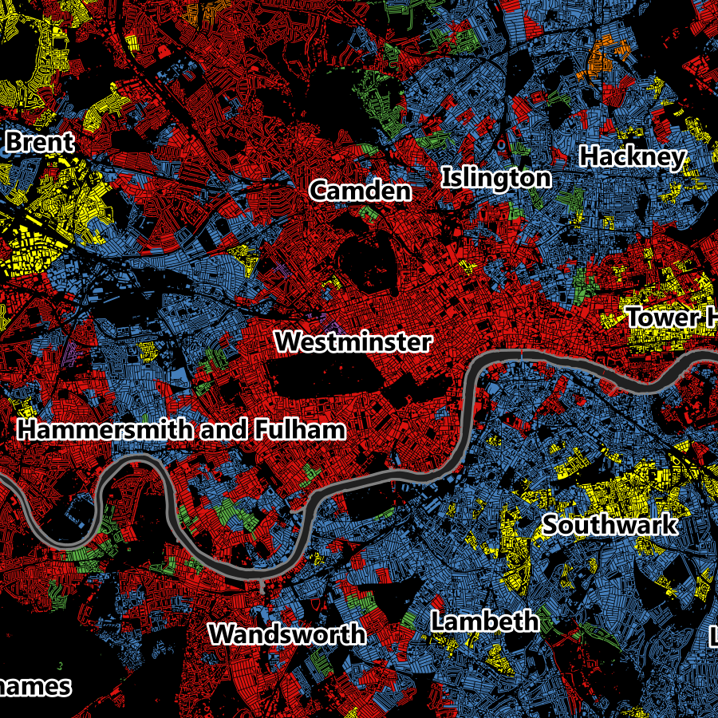
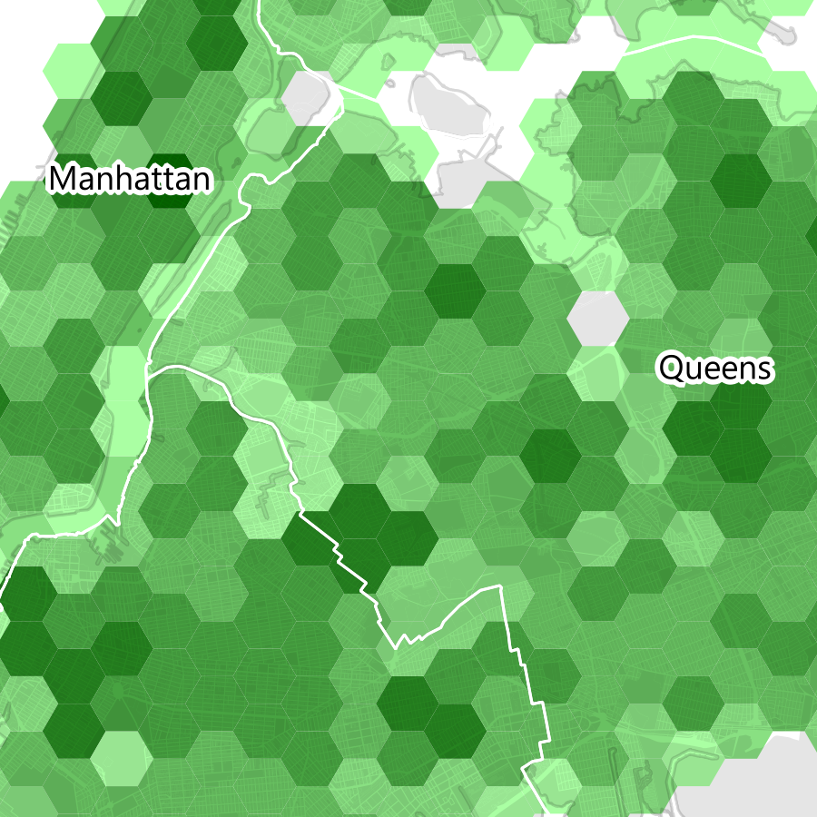
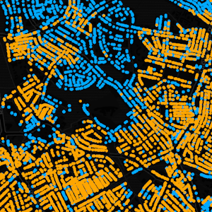
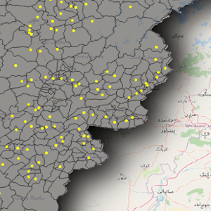

::: {.project-grid}

::: {.project-card}

::: {.project-card-body}

### Net Zero Vulnerability Index

I developed an index to compare the vulnerability of UK regions to green economic restructuring.

::: {.project-card-links}

[Website](https://tcantellow.github.io/netzeroindex/index.html) · [Article](https://doi.org/10.1080/21681376.2025.2600184)

:::
:::
:::

::: {.project-card}

::: {.project-card-body}

### A spatial typology of energy (in)efficiency

Published in *Environment and Planning B: Urban Analytics and City Science*, this journal article explores energy and housing characteristics for private rentals in the UK.

::: {.project-card-links}

[Article](https://doi.org/10.1177/23998083251377128)

:::
:::
:::

::: {.project-card}

::: {.project-card-body}

### The Salt Fringe

Published in *Geo: Geography and Environment*, this journal article explores the energy efficiency of homes in seaside towns.

::: {.project-card-links}

[Article](https://doi.org/10.1002/geo2.70008)

:::
:::
:::

::: {.project-card}

::: {.project-card-body}

### Neoliberalism's 'New Divides'

My PhD thesis explores contemporary inequality and politics in the UK, with a focus on cultural and economic cleavages.

::: {.project-card-links}

[Thesis](https://research-information.bris.ac.uk/en/studentTheses/the-new-divides-of-neoliberalism)

:::
:::
:::

::: {.project-card}

::: {.project-card-body}

### Retrofitting Rentals

A project assessing the state of energy efficiency in Bristol's private rental sector.

::: {.project-card-links}

[Report](https://www.bristol.ac.uk/policybristol/policy-engagement-projects/retrofitting-rentals-bristol/) · [Map](https://uobristol.maps.arcgis.com/apps/instant/interactivelegend/index.html?appid=bdc9bdf0ac9a405fb48e926e461679ed)

:::
:::
:::

::: {.project-card}

::: {.project-card-body}

### Good Credit Index

I produced all maps included in Demos' 2023 Good Credit Index Report.

::: {.project-card-links}

[Report](https://demos.co.uk/research/credit-in-the-cost-of-living-crisis-the-good-credit-index-2023/)

:::
:::
:::

::: {.project-card}

::: {.project-card-body}

### Cryptoassets Briefing

A briefing on Cryptoassets produced during the application process for a 3-month internship with the Home Office's Central Analysis and Insights Team.

::: {.project-card-links}

[Report](assets/Cryptoassets.pdf)

:::
:::
:::

::: {.project-card}

::: {.project-card-body}

### Master's Dissertation

*A Spatial Examination of Populism and Absenteeism in the UK in the Context of the 2016 EU Referendum* — submitted 2018 for my MSc in Applied GIS at the University of Sheffield, winner of the Ian Masser Prize for best master's dissertation.

::: {.project-card-links}

[Dissertation](assets/Cantellow_MSc.pdf)

:::
:::
:::

:::

## Portfolio

A selection of maps I have produced. Click for full size maps.

::: {.portfolio-container}

::: {.portfolio-item}

A dasymetric map of London's buildings, coloured by the largest ethnic minority of each neighbourhood. Produced as part of my MSc in Applied GIS.

:::

::: {.portfolio-item}

A hexagon-binned density map of all of New York City's street trees. Produced as part of my MSc in Applied GIS.

:::

::: {.portfolio-item}

A point map of Bristol's Buildings, visualising their construction date. Produced as part of the Retrofitting Rentals project.

:::

::: {.portfolio-item}

An animated map showing cumulative instances of political violence during the Taliban's takeover of Afghanistan in 2021. Produced using [ACLED](https://acleddata.com/) data, for a QGIS workshop delivered to undergraduate students.

:::

:::